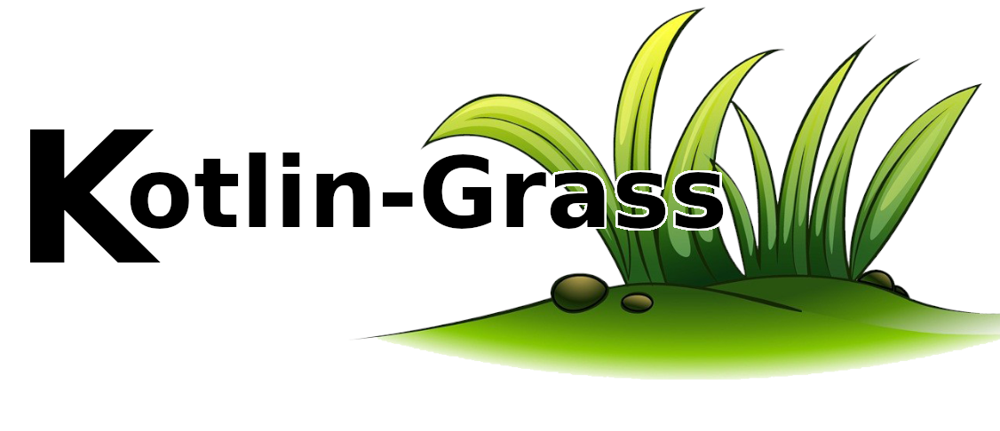

<p>
  
  <a href="/>https://repo1.maven.org/maven2/io/github/blackmo18/kotlin-grass-jvm/0.7.1/">
    
  </a>
  <a href="/>https://repo1.maven.org/maven2/io/github/blackmo18/kotlin-grass-jvm/0.7.1/">
    
  </a>
  <a href="https://github.com/blackmo18/kotlin-grass/blob/master/LICENSE">
    
  </a>
  <a href="https://github.com/blackmo18/kotlin-grass/workflows/build/badge.svg?branch=master">
    
  </a>
  <a href="https://www.codefactor.io/repository/github/blackmo18/kotlin-grass">
    
  </a>
  <a href="https://codecov.io/gh/blackmo18/kotlin-grass">
    
  </a>
</p>

> Csv File to Kotlin  Data Class Parser<br />
> Currently, it requires to have  `@ExperimentalStdlibApi` on the class/method  using  this Library.<br />
> Requires [kotlin-csv by doyaaaaaken](https://github.com/doyaaaaaken/kotlin-csv/) for reading csv file.<br />

# Features

### 1. Simple And Direct
  * No hard configuration
  * No invasive annotations to data class
  * Custom mapping
  * Nullable Data Types
### 2. Primitive Types
  * Short
  * Int
  * Long
  * Float
  * Double
  * Boolean
  * String
### 3. Support for Java 8 Date Time Apis
  * LocalTime
  * LocalDateTime
  * LocalDate
  * Custom Formatting


# Usage
#### Gradle DSL:
```kotlin
//doyaaaaaken's kotlin-csv
implementation("com.github.doyaaaaaken:kotlin-csv-jvm:0.15.2")
//kotlin-grass
implementation("io.github.blackmo18:kotlin-grass-core-jvm:1.0.0")
implementation("io.github.blackmo18:kotlin-grass-parser-jvm:0.8.0")
```

#### Maven:
```xml
<dependency>
    <groupId>com.github.doyaaaaaken</groupId>
    <artifactId>kotlin-csv-jvm</artifactId>
    <version>0.15.2</version>
</dependency>
<dependency>
    <groupId>io.github.blackmo18</groupId>
    <artifactId>kotlin-grass-core-jvm</artifactId>
    <version>1.0.0</version>
</dependency>
<dependency>
    <groupId>io.github.blackmo18</groupId>
    <artifactId>kotlin-grass-parser-jvm</artifactId>
    <version>0.8.0</version>
</dependency>
```

## Examples
#### CSV file
|short|int|long|float|double|boolean|string
|---------------|---------------|---------------|---------------|---------------|---------------|---------------|
|0|1|2|3.0|4.0|true|hello|
#### Declaring data class
```kotlin
    data class PrimitiveTypes(
        val short: Short,
        val int: Int,
        val long: Long,
        val float: Float,
        val double: Double,
        val boolean: Boolean,
        val string: String
    )
```

#### Nullable Data Types
If a variable in your data class is a nullable, all you have to do is mark it with  `?`
```kotlin
    data class NullableData(
        val nullableString: String?,
        val nullableInt: Int? = null,
        ...
    )
```

#### Parsing  to data class
```kotlin
    val csvContents = csvReader().readAllWithHeader(file)
    val dataClasses = grass<PrimitiveTypes>().harvest(csvContents)
```

#### Parsing  to data class using Kotlin Flow
```kotlin
    val contents = File("file/path").inputStream()
    val dataClasses: Flow<PrimitiveTypes> = csvReader().openAsync(contents) {
        val data = readAllWithHeaderAsSequence().asFlow()
        grass<PrimitiveTypes>().harvest(data)
    }
```

# Custom Configuration
| Option | default value | description                         |
|------------|---------------|-------------------------------------|
| dateFormat |`yyyy-MM-dd`| date format |
| timeFormat | `HH:mm` | time format |
| dateTimeSeparator | `(space)` | date time separator |
| trimWhiteSpace | `true` | trims white spaces on csv entries |
| ignoreUnknownFields | `false` | ignore unknown / unmapped fields in input |
| caseSensitive | `true` | case sensitive header matching |
| customKeyMap | `null` |`Map<String,String>` custom key mapping, priority if not empty or null  |
| customKeyMapDataProperty | `null` |`Map<String, KProperty<*>>` custom key mapping  |

# Java Date Time API Support
#### csv file
|time|datetime|date
|---------------|---------------|---------------|
|12:00|2020-12-31 12:00|2020-12-31|
#### Date and Time Types
#### Import the following extension library
```kotlin
implementation("com.vhl.blackmo:kotlin-grass-date-time-jvm:0.8.0")
```
```kotlin
    data class DateTimeTypes(
        val time: LocalTime,
        val datetime: LocalDateTime,
        val date: LocalDate,
    )
```

#### Customize Formatting
```kotlin
    val grass = grass<DateTimeTypes> {
        dateFormat = "MM-dd-yyyy"
        timeFormat = "HH:mm:ss"
        dateTimeSeparator = "/"
        customDataTypes = arrayListOf(Java8DateTime)
    }
```
# Custom Mapping Support
#### CSV file
|hour|birthdate|
|---------------|---------------|
|12:00|2020-12-31|

#### Code
```kotlin
    data class DateTime(
        val time: LocalTime,
        val date: LocalDate,
    )

    val grass = grass<DateTimeTypes> {
        customKeyMap = mapOf("hour" to "time", "birthdate" to "date")
    }

    // or

    val grass = grass<DateTimeTypes> {
        customKeyMapDataProperty = mapOf("hour" to DateTime::time, "birthdate" to DateTime::date)
    }
```

## 🤝 Contributing

Contributions, issues and feature requests are welcome!  
Feel free to check [issues page](https://github.com/blackmo18/kotlin-grass/issues).

Changelog: [changelog.md]

## Show your support

Give a ⭐️ if this project helped you!

## 📝 License
Copyright © 2020 [blackmo18](https://github.com/blackmo18). <br />
This project is [Apache License 2.0](https://github.com/blackmo18/kotlin-grass/blob/master/LICENSE) licensed.

***
This project inspired ❤️ by [kotlin-csv](https://github.com/doyaaaaaken/kotlin-csv)
